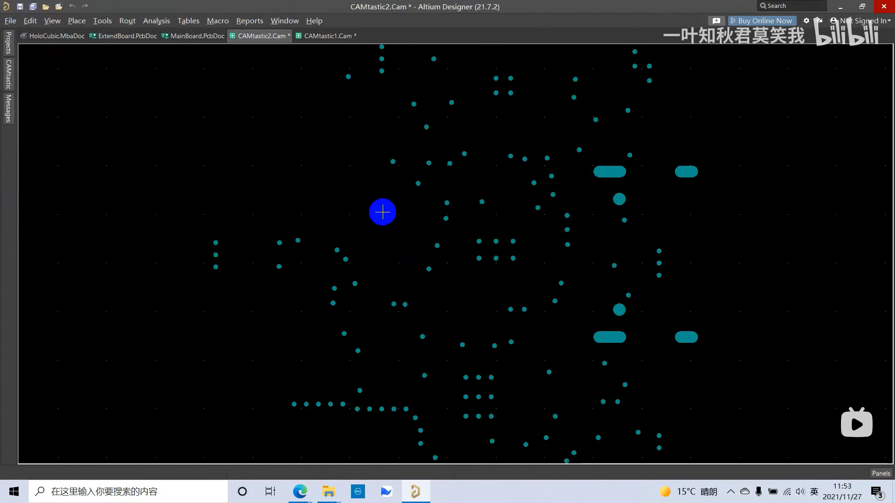

### 整体架构

#### Altium Designer 相关操作

- 2D / 3D 查看

  按`2`切换为2D；按`3`切换为3D，3D模式下按`Shift + 鼠标右键`可以滚动和翻转。

- 导出给 PCB 打印厂

  导出为 PCB 文件，其显示效果容易受到不同版本的 AD 影响，也容易泄露 PCB 板的布局。导出为 Gerber 文件则不受上述影响。

  导出为 Gerber 文件步骤：

  生成 Gerber 文件：

  1. 点击右上角的`File`，之后点击长的弹出面板的`Fabrication Outputs`，再点击断面板的`Gerber Files`。

     

  2. 在弹出的窗口的`General`选项卡里设置`Units`为`Inches`,`Format`设置为`2.5`。

     

  3. 在`Layers`选项卡里的`Polt Layers`下拉菜单栏里选择`Used On`，`Mirror Layers`下拉菜单栏里选择`All Off`。

     

  4. 在`Drill Drawing`选项卡里把两个为`Polt all used drill pairs`的选项都选上。

     

  5. 然后点击弹窗的`OK`按钮来生成。

     

  6. 生成的 Gerber 文件

     

  生成孔定位文件：

  1. 点击`NC Drill Files`

     

  2. 在之后的弹窗都点`OK`，生成的如下的孔定位文件。

     

  打包上传给[嘉立创](https://m.jlc.com/mapp/)（PCB打印厂商）：

  将`Project Outputs for MainBorad`文件夹压缩打包后上传到嘉立创。

  

  

- 元器件购买

  1. 导出BOM表

     点击顶部的`Reports`后，在面板里选择第一项`Bill of Materials`。

     

  2. 在弹窗的右下角选择`Export...`，保存到你指定的位置

     

  3. 根据导出的Excel版的BOM表选购元器件，可以在嘉立创商城或者淘宝上购买。
